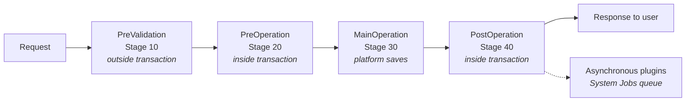
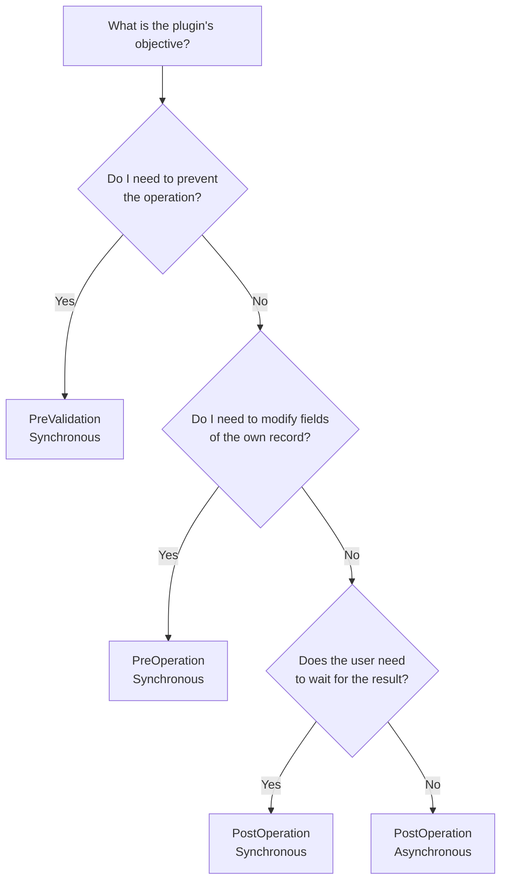
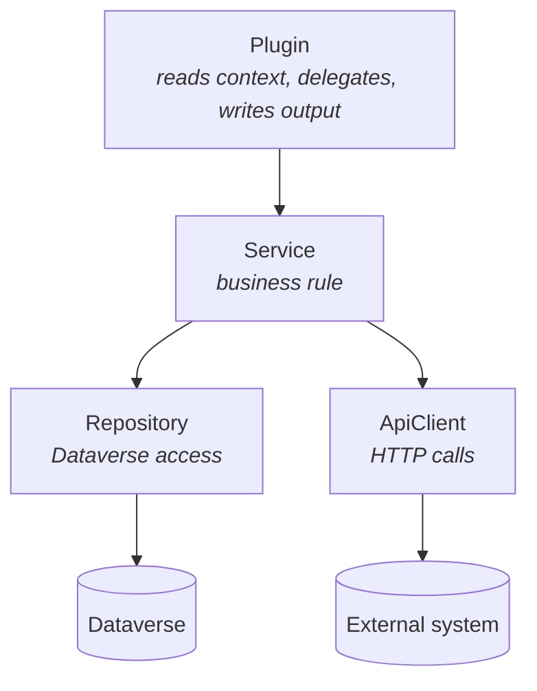

# Plugin Development Guide for Dynamics 365 / Dataverse

*Patterns, best practices and publication considerations, based on official Microsoft recommendations. Written for development teams with limited experience in Dynamics.*

Version 1.2 | 2026-08-28

> Each subsection brings a **📚 References** block with official Microsoft Learn links that support the content. Section 12 consolidates all of them.

---

## How to Use This Guide

| If you want... | Go to |
|---|---|
| Understand what a plugin is and when to use it | Section 1 |
| Write your first plugin | Section 2 |
| Decide stage, sync/async, images | Section 3 |
| Learn code patterns | Section 4 |
| Keep the system fast | Section 5 |
| **Register and publish without breaking the environment** | Section 6 |
| Create a custom operation (Custom API) | Section 6.8 |
| Move the plugin from DEV to PROD | Section 7 |
| Ready-to-use checklists for code review and deploy | Section 11 |
| All official links organized by topic | Section 12 |

---

## 1. Overview

### 1.1 What is a plugin

A plugin is a C# class that runs **inside the Dataverse server**, triggered by a data event (create, update, delete a record, call an API, etc.).

Analogy: Dataverse is a database with rules. The plugin is a **trigger** written in C#. It enters the middle of the operation and can:

- validate data and **cancel** the operation;
- **modify** values before saving;
- create or update **other** records;
- call **external systems** via HTTP;
- return values to the caller.

> 📚 **References**
> • [Use plug-ins to extend business processes](https://learn.microsoft.com/power-apps/developer/data-platform/plug-ins)
> • [Interface `IPlugin`](https://learn.microsoft.com/dotnet/api/microsoft.xrm.sdk.iplugin)
> • [Apply business logic using code](https://learn.microsoft.com/power-apps/developer/data-platform/apply-business-logic-with-code)

### 1.2 Before writing a plugin: stop and think

Microsoft is explicit: **evaluate non-code options first**. A plugin is the most powerful tool and also the easiest to misuse.

| Need | Try first | Use plugin when |
|---|---|---|
| Validate field on screen | Business Rule | Validation depends on data from other tables or external system |
| Calculate a value | Calculated column / Rollup | Calculation is complex or involves heavy conditional logic |
| Create related record | Power Automate | Must be immediate and transactional (all or nothing) |
| Integrate with external system | Power Automate / Azure Service Bus / Webhook | Must be synchronous or has complex transformation logic |
| React to status change | Workflow / Power Automate | Must run within the transaction |
| **Create a customizable and reusable operation/action** | **Custom API** (see 6.8) | The recommended code-first approach — avoid creating new Custom Workflow Activities |

> 📌 **Custom API x Custom Process Action x Custom Workflow Activity**
>
> Microsoft positions **Custom API** as the code-first alternative to *custom process actions*, which are no-code and have developer limitations. For new custom operations, **prefer Custom API**.
>
> Custom Workflow Activities (`CodeActivity`) are not formally deprecated, but are a legacy model: they don't support configurable entity images, don't allow you to choose the execution stage, and the workflow designer itself is being replaced by Power Automate. Use them only to maintain existing solutions.

**Plugin advantages:** it's the most performant way to apply custom logic and the most powerful.

**Plugin disadvantages:** requires a developer, it's easy to degrade system performance throughout and has a **hard time limit**.

> 📚 **References**
> • [When to use plug-ins (advantages and disadvantages)](https://learn.microsoft.com/power-apps/developer/data-platform/plug-ins#when-to-use-plug-ins)
> • [Apply business logic in Dataverse (declarative options)](https://learn.microsoft.com/power-apps/maker/data-platform/processes)
> • [Business rules](https://learn.microsoft.com/power-apps/maker/data-platform/data-platform-create-business-rule)
> • [Calculated columns and rollup](https://learn.microsoft.com/power-apps/maker/data-platform/define-calculated-fields)
> • [Azure integration (Service Bus) and webhooks](https://learn.microsoft.com/power-apps/developer/data-platform/azure-integration)
> • [Compare custom process action and custom API](https://learn.microsoft.com/power-apps/developer/data-platform/custom-actions#compare-custom-process-action-and-custom-api)
> • [Create workflow extensions (legacy model)](https://learn.microsoft.com/power-apps/developer/data-platform/workflow/workflow-extensions)

### 1.3 The lifecycle: the execution pipeline

Every operation in Dataverse goes through a four-stage pipeline. **Understanding this is the number one requirement** for writing a good plugin.



| Stage | No. | Transaction? | Purpose |
|---|---|---|---|
| `PreValidation` | 10 | **Outside** (usually) | Validate and **cancel** the operation |
| `PreOperation` | 20 | Inside | **Modify values** of the record before saving |
| `MainOperation` | 30 | Inside | Platform saves. Only registrable for Custom API and virtual tables |
| `PostOperation` | 40 | Inside | **React** to what was saved |

Two details that catch beginners:

1. **`PreValidation` runs before security checks.** The platform hasn't yet confirmed if the user has permission. Don't assume privilege.
2. **`PreValidation` isn't always outside the transaction.** If your record was created by another plugin in `PostOperation`, its `PreValidation` participates in the first plugin's transaction. Check with `context.IsInTransaction`.

> 📚 **References**
> • [Event Framework — Event execution pipeline](https://learn.microsoft.com/power-apps/developer/data-platform/event-framework#event-execution-pipeline)
> • [Cancel the current operation (`PreValidation` and transaction)](https://learn.microsoft.com/power-apps/developer/data-platform/handle-exceptions#cancel-the-current-operation)
> • [Property `IExecutionContext.IsInTransaction`](https://learn.microsoft.com/dotnet/api/microsoft.xrm.sdk.iexecutioncontext.isintransaction)
> • [Create and use custom APIs (`MainOperation`)](https://learn.microsoft.com/power-apps/developer/data-platform/custom-api)

---

## 2. Plugin Anatomy

### 2.1 The minimal structure

```csharp
using System;
using Microsoft.Xrm.Sdk;

public class MyPlugin : IPlugin
{
    public void Execute(IServiceProvider serviceProvider)
    {
        // 1. Context: who called, which message, which data
        IPluginExecutionContext context =
            (IPluginExecutionContext)serviceProvider.GetService(typeof(IPluginExecutionContext));

        // 2. Tracing: your diagnostic log
        ITracingService tracing =
            (ITracingService)serviceProvider.GetService(typeof(ITracingService));

        // 3. Service for accessing Dataverse
        IOrganizationServiceFactory factory =
            (IOrganizationServiceFactory)serviceProvider.GetService(typeof(IOrganizationServiceFactory));
        IOrganizationService service = factory.CreateOrganizationService(context.UserId);

        try
        {
            // Your logic here
        }
        catch (Exception ex)
        {
            tracing.Trace("MyPlugin failed: {0}", ex.ToString());
            throw new InvalidPluginExecutionException("An error occurred while processing the record.", ex);
        }
    }
}
```

> 💡 The user **is already authenticated**. Never try to authenticate again. And **don't use Web API inside plugins** — it's not supported; use `IOrganizationService`.

> ⚠️ **Never call `Dispose()` on services obtained from `IServiceProvider`.** The lifecycle of `IPluginExecutionContext`, `ITracingService`, `IOrganizationServiceFactory`, and `IOrganizationService` is managed by the platform. Disposing them can break the execution of the plugin itself or other steps in the same pipeline.

```csharp
// ❌ WRONG — the using block disposes a resource that's not yours
using (var service = factory.CreateOrganizationService(context.UserId))
{
    service.Update(target);
}

// ✅ CORRECT — just use it; the platform handles disposal
IOrganizationService service = factory.CreateOrganizationService(context.UserId);
service.Update(target);
```

The rule only applies to what comes from `IServiceProvider`. Resources that **you** create (a `MemoryStream`, for example) remain your responsibility.

> 📚 **References**
> • [Write a plug-in](https://learn.microsoft.com/power-apps/developer/data-platform/write-plug-in)
> • [Services you can use in your code](https://learn.microsoft.com/power-apps/developer/data-platform/write-plug-in#services-you-can-use-in-your-code)
> • [Tutorial: Write and register a plug-in](https://learn.microsoft.com/power-apps/developer/data-platform/tutorial-write-plug-in)
> • [Interface `IOrganizationService`](https://learn.microsoft.com/dotnet/api/microsoft.xrm.sdk.iorganizationservice)

### 2.2 Use a base class (official recommendation)

Repeating this "plumbing" block in every plugin is wasteful. Microsoft provides a `PluginBase` class generated by official tools:

```bash
# Generates a plugin project already with PluginBase.cs
pac plugin init --outputDirectory ./MyProject
```

With it, your plugin becomes:

```csharp
public class MyPlugin : PluginBase
{
    public MyPlugin(string unsecureConfiguration, string secureConfiguration)
        : base(typeof(MyPlugin)) { }

    protected override void ExecuteDataversePlugin(ILocalPluginContext localContext)
    {
        var context = localContext.PluginExecutionContext;
        var service = localContext.PluginUserService;
        var tracing = localContext.TracingService;

        // Just business logic. No plumbing.
    }
}
```

**Standardize a single style across the team** — either `PluginBase` from `pac`, or the one from Power Platform Tools, or a custom base. Mixing styles causes confusion.

> 📚 **References**
> • [PluginBase abstract class](https://learn.microsoft.com/power-apps/developer/data-platform/write-plug-in#pluginbase-abstract-class)
> • [Command `pac plugin`](https://learn.microsoft.com/power-platform/developer/cli/reference/plugin)
> • [Quickstart: create plugin with Power Platform Tools](https://learn.microsoft.com/power-apps/developer/data-platform/tools/devtools-create-plugin)

### 2.3 The context properties you'll use most

| Property | What is it | When to use |
|---|---|---|
| `MessageName` | `Create`, `Update`, `Delete`... | Defensive validation |
| `PrimaryEntityName` | Logical table name | Defensive validation |
| `Stage` | 10, 20, 40 | Confirm correct stage |
| `Depth` | Depth of the call chain | **Avoid infinite loop** |
| `IsInTransaction` | If inside the transaction | Decide whether to cancel cheaply |
| `InputParameters` | Input data (`Target`) | Read the record |
| `OutputParameters` | Output data | Return result (only in `PostOperation`) |
| `PreEntityImages` | Snapshot **before** the operation | Compare old value |
| `PostEntityImages` | Snapshot **after** the operation | Read final values |
| `UserId` | User under which code runs | Create `IOrganizationService` |
| `InitiatingUserId` | Who actually clicked | Audit |
| `SharedVariables` | Data between plugins of the same operation | Pass info from Pre to Post |

> 📚 **References**
> • [Understand the execution context](https://learn.microsoft.com/power-apps/developer/data-platform/understand-the-data-context)
> • [Interface `IPluginExecutionContext`](https://learn.microsoft.com/dotnet/api/microsoft.xrm.sdk.ipluginexecutioncontext)
> • [Interface `IExecutionContext`](https://learn.microsoft.com/dotnet/api/microsoft.xrm.sdk.iexecutioncontext)
> • [Shared variables](https://learn.microsoft.com/power-apps/developer/data-platform/understand-the-data-context#shared-variables)

### 2.4 Reading the record safely

The `Target` **doesn't always exist** and **isn't always an `Entity`**.

```csharp
// ✅ CORRECT
if (!context.InputParameters.Contains("Target") ||
    !(context.InputParameters["Target"] is Entity target))
{
    return;
}

// ❌ WRONG — crashes the user's operation with InvalidCastException
Entity target = (Entity)context.InputParameters["Target"];
```

| Message | Type of `Target` |
|---|---|
| `Create` | `Entity` |
| `Update` | `Entity` — **contains only modified fields** |
| `Delete` | `EntityReference` |
| `Assign`, `SetState` | `EntityReference` |

> 📚 **References**
> • [InputParameters and OutputParameters](https://learn.microsoft.com/power-apps/developer/data-platform/understand-the-data-context#inputparameters)
> • [Use messages with the SDK for .NET](https://learn.microsoft.com/power-apps/developer/data-platform/org-service/use-messages)
> • [Namespace `Microsoft.Xrm.Sdk.Messages`](https://learn.microsoft.com/dotnet/api/microsoft.xrm.sdk.messages)
> • [Using early-bound types in plug-in code](https://learn.microsoft.com/power-apps/developer/data-platform/write-plug-in#using-early-bound-types-in-plug-in-code)

### 2.5 The `Update` pitfall

In `Update`, the `Target` brings **only what changed**. If the user changed only the phone, the `name` field won't be there.

```csharp
// ❌ This will return null and you'll think it's a platform bug
string name = target.GetAttributeValue<string>("name");

// ✅ Always check
if (target.Contains("name"))
{
    string name = target.GetAttributeValue<string>("name");
}
```

To know the **previous** value, use Pre Image (section 3.4) — never a `Retrieve`.

> 📚 **References**
> • [Entity images](https://learn.microsoft.com/power-apps/developer/data-platform/understand-the-data-context#entity-images)
> • [Define entity images when registering the step](https://learn.microsoft.com/power-apps/developer/data-platform/register-plug-in#define-entity-images)
> • [Behavior of specialized update operations](https://learn.microsoft.com/power-apps/developer/data-platform/special-update-operation-behavior)

---

## 3. Design Decisions (the most important)

Before writing a single line, answer these four questions. They define how the plugin will be registered.



### 3.1 Question 1 — What stage?

| Objective | Stage | Why |
|---|---|---|
| Block the save with an error message | `PreValidation` | Cancels **before** the transaction; cheap |
| Fill/adjust a field of the record being saved | `PreOperation` | Just modify `Target` in memory; no extra `Update` |
| Create related record, call API, notify | `PostOperation` | The record already exists and has an ID |
| Read the ID of a newly created record | `PostOperation` | The ID only exists after saving |

**Golden rules of stages:**

```csharp
// ✅ PreOperation: just modify Target. DON'T call Update.
target["priority"] = new OptionSetValue(1);

// ❌ PreOperation: this triggers a new Update event and can cause loop
service.Update(new Entity("account", target.Id) { ["priority"] = new OptionSetValue(1) });
```

- **Don't cancel in `PreOperation` or `PostOperation`.** Canceling there forces rollback of the transaction, with significant performance impact. Cancel in `PreValidation`.
- **Don't modify the entity of the message in `PostOperation`.** This triggers a new `Update` event.

> 📚 **References**
> • [Event Pipeline Stage of execution](https://learn.microsoft.com/power-apps/developer/data-platform/register-plug-in#event-pipeline-stage-of-execution)
> • [Event execution pipeline](https://learn.microsoft.com/power-apps/developer/data-platform/event-framework#event-execution-pipeline)
> • [Cancel the current operation](https://learn.microsoft.com/power-apps/developer/data-platform/handle-exceptions#cancel-the-current-operation)

### 3.2 Question 2 — Synchronous or asynchronous?

| | Synchronous | Asynchronous |
|---|---|---|
| When it runs | Immediately | Later, in the System Jobs queue |
| Does user wait? | **Yes** | No |
| Can cancel the operation? | Yes | **No** |
| Rollback on error | Yes | Doesn't affect original operation |
| Allowed stages | 10, 20, 40 | **PostOperation only (40)** |
| Where error appears | Dialog box for user | **System Jobs** table |
| Supports automatic retry | No | **Yes** (up to 4 attempts) |

**How to decide:**

- Does the plugin need to **block** the operation? → Synchronous, mandatory.
- Does the plugin make an **external HTTP call**? → Asynchronous, barring strong justification.
- Does the plugin take **more than 2 seconds**? → Asynchronous.
- None of the above? → Synchronous is fine.

> 📌 **The number almost nobody knows:** Microsoft recommends limiting plugin execution to **maximum 2 seconds**. The hard limit of **2 minutes** is the entire operation ceiling — the message plus *all* synchronous plugins registered, not just yours. You share this budget with the rest of the system.

**Mandatory case:** if the plugin does an `Update` and is registered on `Create` of the **SystemUser (User)** table, it **must** be asynchronous. It's a platform requirement.

> 📚 **References**
> • [Execution Mode (sync x async)](https://learn.microsoft.com/power-apps/developer/data-platform/register-plug-in#execution-mode)
> • [Asynchronous service](https://learn.microsoft.com/power-apps/developer/data-platform/asynchronous-service)
> • [Analyze plug-in performance — Time and resource constraints](https://learn.microsoft.com/power-apps/developer/data-platform/analyze-performance#time-and-resource-constraints)
> • [Asynchronous plug-in steps](https://learn.microsoft.com/power-apps/developer/data-platform/event-framework#asynchronous-plug-in-steps)
> • [Table AsyncOperation (System Jobs)](https://learn.microsoft.com/power-apps/developer/data-platform/reference/entities/asyncoperation)

### 3.3 Question 3 — Which fields should trigger the plugin? (Filtering Attributes)

This is **the most important publication care of all** and the most common mistake of beginner teams.

When you register a step in the `Update` message **without filtering attributes**, the plugin runs **every time any field** of that table changes — including bulk processes, integrations, and other plugins. On a busy table this means thousands of useless executions per day.

```text
❌ Update step on "account" table without filtering attributes
   → fires when name, phone, address, owner, status changes...
   → fires on data imports
   → fires when another plugin updates any field

✅ Update step on "account" table with filtering attributes = telephone1, emailaddress1
   → fires only when one of these two fields is in the request
```

**How to choose the right fields:**

1. List the fields that your **plugin's logic really reads or depends on**.
2. Mark **only** those fields as filtering attributes.
3. **Never include the primary key** (`accountid`, `contactid`, etc.). The primary key goes in *every* update operation, so including it **voids all other filters** — it's like having no filter at all.
4. Document the choice (in code or in the repository), so whoever maintains it knows why.

> ⚠️ **Important nuance:** the filter checks if the field **is present in the request**, not if the value **actually changed**. If the app sends `telephone1` with the same value as before, the plugin fires. If you need to react only to real changes, compare with the Pre Image inside the code:

```csharp
private static bool ActuallyChanged(Entity target, Entity preImage, string field)
{
    if (!target.Contains(field))
    {
        return false;
    }

    object newValue = target[field];
    object oldValue = preImage != null && preImage.Contains(field) ? preImage[field] : null;

    return !Equals(newValue, oldValue);
}
```

**Another care:** if you register a step on messages like `Update`, `Delete`, or `Retrieve` **without specifying the primary table**, the plugin will be invoked for **all tables** that support that message. Always specify the table.

> 📚 **References**
> • [Include filtering attributes with plug-in registration (official best practice)](https://learn.microsoft.com/power-apps/developer/data-platform/best-practices/business-logic/include-filtering-attributes-plugin-registration)
> • [General Configuration Information Fields (Filtering Attributes field)](https://learn.microsoft.com/power-apps/developer/data-platform/register-plug-in#general-configuration-information-fields)
> • [Don't duplicate plug-in step registration](https://learn.microsoft.com/power-apps/developer/data-platform/best-practices/business-logic/do-not-duplicate-plugin-step-registration)

### 3.4 Question 4 — Do I need Entity Images?

Entity Image is a "snapshot" of the record that the platform delivers with the context, **at no query cost**.

```csharp
// ❌ WRONG — one database hit per execution
Entity account = service.Retrieve("account", target.Id, new ColumnSet("name", "revenue"));

// ✅ CORRECT — Pre Image registered in the step, already comes ready
if (context.PreEntityImages.TryGetValue("PreImage", out Entity preImage))
{
    string oldName = preImage.GetAttributeValue<string>("name");
}
```

**Image availability** (platform rule, not your choice):

| Message | Pre Image | Post Image |
|---|---|---|
| `Create` | ❌ Doesn't exist (record doesn't exist yet) | ✅ Only in `PostOperation` |
| `Update` | ✅ | ✅ Only in `PostOperation` |
| `Delete` | ✅ | ❌ Doesn't exist (record no longer exists) |

Post Image **only exists in `PostOperation`** — before that the platform doesn't know the final result.

**Messages that support images:** `Assign`, `Create`, `Delete`, `DeliverIncoming`, `DeliverPromote`, `Merge`, `Route`, `Send`, `SetState`, `Update`.

**Cares when registering an image:**

- The default behavior of the tool is to **mark all columns**. **Don't do that** — it hurts performance. Mark only what the code uses.
- Set a **stable alias** (`PreImage`, `PostImage`) and use that exact name in the code. Wrong alias = `KeyNotFoundException` in production.
- If the code starts using a new field, **remember to add it to the image** and redeploy the step.

> 📚 **References**
> • [Define entity images (types, availability, and supported messages)](https://learn.microsoft.com/power-apps/developer/data-platform/register-plug-in#define-entity-images)
> • [Entity images in execution context](https://learn.microsoft.com/power-apps/developer/data-platform/understand-the-data-context#entity-images)
> • [Property `PreEntityImages`](https://learn.microsoft.com/dotnet/api/microsoft.xrm.sdk.iexecutioncontext.preentityimages)
> • [Property `PostEntityImages`](https://learn.microsoft.com/dotnet/api/microsoft.xrm.sdk.iexecutioncontext.postentityimages)
> • [Tutorial: add an image to a step](https://learn.microsoft.com/power-apps/developer/data-platform/tutorial-update-plug-in#add-an-image)

---

## 4. Implementation Patterns

### 4.1 Rule #1: plugins are stateless

The platform **caches the instance** of your class and reuses it between executions, possibly in parallel.

```csharp
// ❌ WRONG — instance fields are shared. Race condition guaranteed.
public class BadPlugin : IPlugin
{
    private IOrganizationService _service;
    private Entity _target;
    private int _counter;

    public void Execute(IServiceProvider sp) { _service = ...; _counter++; }
}

// ✅ CORRECT — everything in local variables
public class GoodPlugin : IPlugin
{
    public void Execute(IServiceProvider sp)
    {
        IOrganizationService service = ...;  // local, safe
    }
}
```

**What can be a class field:** constants, helper methods, and `readonly` configuration fields received in the constructor.

**What can never be:** service instance, context, `Target`, counters, cache — all of this changes with each invocation.

For the same reason: **multithreading and parallel execution are not supported**. No `Parallel.ForEach`, `Task.Run`, or custom threads.

> 📚 **References**
> • [Develop `IPlugin` implementations as stateless](https://learn.microsoft.com/power-apps/developer/data-platform/best-practices/business-logic/develop-iplugin-implementations-stateless)
> • [Don't use parallel execution within plug-ins](https://learn.microsoft.com/power-apps/developer/data-platform/best-practices/business-logic/do-not-use-parallel-execution-in-plug-ins)
> • [IPlugin interface — note on stateless](https://learn.microsoft.com/power-apps/developer/data-platform/write-plug-in#iplugin-interface)

### 4.2 Rule #2: the plugin should be thin

The plugin translates the context and delegates. Business rule lives in common, testable classes that don't know Dataverse.



```csharp
// ❌ WRONG — business rule, loop, and query inside the plugin
public class BadPlugin : IPlugin
{
    public void Execute(IServiceProvider sp)
    {
        // ... get services ...
        foreach (var item in items)
        {
            if (item.Active && item.Type == 3 && item.Date < DateTime.Now.AddDays(-30))
            {
                var task = new Entity("task");
                task["subject"] = "Review " + item.Name.ToUpper();
                service.Create(task);
            }
        }
    }
}

// ✅ CORRECT — plugin translates and delegates
public class GoodPlugin : IPlugin
{
    public void Execute(IServiceProvider sp)
    {
        // ... get services ...
        var repository = new TaskRepository(service);
        var service = new ReviewService(repository, tracing);

        service.GenerateReviewTasks(target.Id);
    }
}
```

**Why this matters in practice:** with the thin plugin, you test `ReviewService` with common mocks, without needing to simulate Dataverse. With logic inside `Execute`, testing a simple `if` requires setting up the entire `IServiceProvider`.

| Layer | Responsibility | Knows `IPluginExecutionContext`? |
|---|---|---|
| Plugin | Read inputs, assemble objects, call service, write outputs | Yes |
| Service | Business rule, validations, orchestration | No |
| Repository | `Create`, `Update`, `RetrieveMultiple` | No |
| ApiClient | HTTP, authentication, serialization | No |
| Models | DTOs | No |

> 📚 **References**
> • [Plug-in design impacts performance](https://learn.microsoft.com/power-apps/developer/data-platform/write-plug-in#plug-in-design-impacts-performance)
> • [Best practices and guidance regarding plug-in and workflow development](https://learn.microsoft.com/power-apps/developer/data-platform/best-practices/business-logic/)
> • [Table operations with the SDK for .NET](https://learn.microsoft.com/power-apps/developer/data-platform/org-service/entity-operations)

### 4.3 Error handling

`InvalidPluginExecutionException` is the **only** exception that lets you control the message shown to the user. Any other becomes `"An unexpected error occurred from ISV code."` — useless to whoever is on screen.

```csharp
// ✅ CORRECT — clear message under your control
throw new InvalidPluginExecutionException(
    "Cannot close the opportunity without an estimated value.");

// ✅ CORRECT — unexpected error, but still under your control
catch (Exception ex)
{
    tracing.Trace(ex.ToString());
    throw new InvalidPluginExecutionException(
        "Unexpected error integrating with the billing system. Contact support.", ex);
}

// ❌ WRONG — user sees generic and useless message
throw new Exception("error");

// ❌❌ WORST — silently swallowing the error leaves data inconsistent with nobody knowing
try { service.Create(entity); } catch { }
```

**Cares:**

- The Unified Interface dialog box **doesn't interpret HTML**. Use plain text.
- Centralize messages in a constants class. Facilitates review, translation, and prevents technical messages leaking to users.
- In **synchronous** plugin, any exception cancels and triggers rollback — with or without `InvalidPluginExecutionException`.
- In **asynchronous** plugin, the error goes to **System Jobs**. Don't silently catch: you lose visibility and the chance to reprocess.

**Retry in asynchronous plugin** (useful for transient network failures):

```csharp
// The asynchronous service will attempt to execute the plugin up to 4 times
throw new InvalidPluginExecutionException(
    OperationStatus.Retry,
    0,
    "External service unavailable. Retrying.");
```

> 📚 **References**
> • [Handle exceptions in a plug-in](https://learn.microsoft.com/power-apps/developer/data-platform/handle-exceptions)
> • [Use `InvalidPluginExecutionException` (official best practice)](https://learn.microsoft.com/power-apps/developer/data-platform/best-practices/business-logic/use-invalidpluginexecutionexception-plugin-workflow-activities)
> • [Class `InvalidPluginExecutionException`](https://learn.microsoft.com/dotnet/api/microsoft.xrm.sdk.invalidpluginexecutionexception)
> • [Retry an asynchronous plug-in](https://learn.microsoft.com/power-apps/developer/data-platform/handle-exceptions#retry-an-asynchronous-plug-in)
> • [Enum `OperationStatus`](https://learn.microsoft.com/dotnet/api/microsoft.xrm.sdk.operationstatus)

### 4.4 Logging with ITracingService

The `ITracingService` writes to the **Plug-in Trace Log**. It's your main diagnostic tool in production.

```csharp
tracing.Trace("Processing account {0}", target.Id);
tracing.Trace("Found {0} related contacts", contacts.Count);
```

**Important:** the Trace Log has a **1 MB limit per message execution**. In high-volume scenarios, every trace counts.

**Best practices:**

- Trace the **reasoning** (why you're about to call this API), not the **result** (HTTP 200 OK). Stack traces on exception are already there.
- Use placeholders (`{0}`, `{1}`) to keep the message size down.
- Don't trace raw XML or full JSON payloads — summarize relevant parts.
- Set a consistent format: `[METHOD_NAME] What happened at what step`.

```csharp
tracing.Trace("[CreateTask] Starting. RecordId={0}", target.Id);
tracing.Trace("[CreateTask] Validation passed. Creating task entity...");
tracing.Trace("[CreateTask] Task created successfully. TaskId={0}", taskId);
```

**Accessing logs in production:**

1. **Using PAC CLI:** `pac plugin trace tail` (shows live logs)
2. **Using UI:** Advanced Find on **Plug-in Trace Log** table in Dataverse
3. **PowerShell:** Query `plugintracelog` table

> 📚 **References**
> • [Logging and tracing](https://learn.microsoft.com/power-apps/developer/data-platform/logging-tracing)
> • [ITracingService interface](https://learn.microsoft.com/dotnet/api/microsoft.xrm.sdk.itracingservice)
> • [pac plugin trace](https://learn.microsoft.com/power-platform/developer/cli/reference/plugin#pac-plugin-trace)
> • [Enable plug-in trace logging](https://learn.microsoft.com/power-apps/developer/data-platform/logging-tracing#enable-plug-in-trace-logging)
> • [Plug-in Trace Log table limits](https://learn.microsoft.com/power-apps/developer/data-platform/logging-tracing#trace-log-size)

### 4.5 Configuration (secure vs. unsecure)

Plugins can receive configuration at runtime: database connection strings, API keys, endpoints, feature flags.

```csharp
public class ApiPlugin : PluginBase
{
    private string _apiKey;
    private string _apiUrl;

    public ApiPlugin(string unsecureConfig, string secureConfig)
        : base(typeof(ApiPlugin))
    {
        _apiUrl = unsecureConfig;        // Visible in plug-in registration. Use for non-sensitive data.
        _apiKey = secureConfig;          // Encrypted in the database. Use for secrets.
    }

    protected override void ExecuteDataversePlugin(ILocalPluginContext localContext)
    {
        var client = new HttpClient();
        client.DefaultRequestHeaders.Add("Authorization", $"Bearer {_apiKey}");
        var response = client.GetAsync($"{_apiUrl}/api/validate").Result;
    }
}
```

**Never hardcode secrets in the plugin code.** Use Secure Configuration or Azure Key Vault.

**Secure Configuration** is encrypted and visible only to plugin developers. **Unsecure Configuration** is visible in plain text in plugin registration — use only for public data (URLs, feature names).

> 📚 **References**
> • [Secure configuration in plug-ins](https://learn.microsoft.com/power-apps/developer/data-platform/write-plug-in#secure-configuration)
> • [Pass configuration data to your plug-in](https://learn.microsoft.com/power-apps/developer/data-platform/register-plug-in#pass-configuration-data-to-your-plug-in)
> • [Azure Key Vault integration](https://learn.microsoft.com/power-apps/developer/data-platform/azure-key-vault-integration)

---

## 5. Performance & Optimization

### 5.1 The most important: avoid making things slower

A plugin that runs on `Create` of the **Account** table affects **every single account creation** — whether it's a user in the UI, an integration, a bulk import, or Power Automate. If your plugin takes 500ms, you've added 500ms to every one of those operations.

**Multiplication factor:** if your plugin runs on a busy table (Account, Contact, Order, etc.) and takes even 100ms, you're impacting thousands of records per day. Multiply by the number of plugins on that table, and suddenly the system feels slow.

**The scenario:**
1. User creates an account and takes 2 seconds to save (normal: 500ms + plugin: 1.5s)
2. User feels frustrated and creates another one; goes through the same wait
3. User starts avoiding the feature and uses Excel instead, importing thousands of records
4. That bulk import triggers your plugin 5000 times in 30 seconds, timing out and causing rollback

**How to design for performance:**

- **Measure first.** Use plug-in trace logs and the **Plugin Profiler** tool. You might be optimizing the wrong thing.
- **In `PreOperation` / `PreValidation`, do only what blocks the save.** Heavy computation belongs in `PostOperation` async.
- **Don't do N+1 queries.** Don't loop, querying for each iteration. Batch with `RetrieveMultiple` using FetchXML.
- **Pre Image and Post Image are free.** Prefer them over `Retrieve`.
- **Avoid `RetrieveMultiple` without conditions.** Filter by the fields you really need.

```csharp
// ❌ N+1 queries
foreach (var relatedId in relatedIds)
{
    var entity = service.Retrieve("contact", relatedId, new ColumnSet(true));  // Query per iteration
    // ...
}

// ✅ Batch query
var query = new QueryExpression("contact")
{
    ColumnSet = new ColumnSet("name", "email"),
    Criteria = new FilterExpression
    {
        Conditions =
        {
            new ConditionExpression("contactid", ConditionOperator.In, relatedIds.Cast<object>().ToArray())
        }
    }
};
var results = service.RetrieveMultiple(query);
```

### 5.2 Monitoring performance

**Plug-in Profiler** is the official tool to measure execution time and database hits:

```bash
pac plugin profiler start
# Run the operation that triggers the plugin
pac plugin profiler stop
```

The output shows:
- **Execution time** of the entire pipeline
- **Database queries** executed
- **API calls** made to external services
- **Time by stage**

> 📚 **References**
> • [Analyze plug-in performance](https://learn.microsoft.com/power-apps/developer/data-platform/analyze-performance)
> • [Use the Plugin Profiler tool](https://learn.microsoft.com/power-platform/developer/cli/reference/plugin#pac-plugin-profiler)
> • [Performance optimization for plug-ins](https://learn.microsoft.com/power-apps/developer/data-platform/best-practices/business-logic/optimize-assembly-development-plug-in-code-guidance)

### 5.3 Avoiding loops

The most common mistake: a plugin that modifies a record, which triggers itself again, which modifies the record again...

```csharp
// ❌ LOOP RISK — creates infinite cycle
public class UpdateAccountPlugin : IPlugin
{
    public void Execute(IServiceProvider sp)
    {
        var context = (IPluginExecutionContext)sp.GetService(typeof(IPluginExecutionContext));
        var service = ((IOrganizationServiceFactory)sp.GetService(typeof(IOrganizationServiceFactory)))
            .CreateOrganizationService(context.UserId);

        if (context.MessageName.Equals("Update") && context.Depth == 1)  // depth=1 means it's the first call
        {
            var target = (Entity)context.InputParameters["Target"];
            target["description"] = "Updated by plugin";  // Ok, modifies the Target
            
            // ❌ This will trigger another Update event!
            service.Update(new Entity("account", target.Id) { ["field"] = "value" });
        }
    }
}

// ✅ CORRECT — check depth to avoid loops
public void Execute(IServiceProvider sp)
{
    var context = (IPluginExecutionContext)sp.GetService(typeof(IPluginExecutionContext));
    
    if (context.Depth > 2)  // Stop if depth exceeds expected limit
    {
        return;
    }
    
    // ... your logic
}
```

**Depth property:** increments each time a plugin triggers another one. Check and limit it to prevent runaway execution.

**Best practice:** always check depth if your plugin might trigger other plugins or if it calls `Update`.

> 📚 **References**
> • [Avoid infinite loops](https://learn.microsoft.com/power-apps/developer/data-platform/best-practices/business-logic/avoid-infinite-loops-plug-ins)
> • [Property `IExecutionContext.Depth`](https://learn.microsoft.com/dotnet/api/microsoft.xrm.sdk.iexecutioncontext.depth)

---

## 6. Registration (The Critical Part)

### 6.1 Where to register: Plugin Registration Tool (PRT)

The official tool to register plugins in Dataverse. There are two versions:

1. **Plugin Registration Tool (GUI)** — graphical interface
2. **Power Platform CLI (`pac plugin register`)** — command line

We recommend **Power Platform CLI** for teams (version control, automation), but both do the same thing.

```bash
# Using PAC
pac plugin register --conn MyConnection --assembly ./bin/Release/MyPlugin.dll
```

> 📚 **References**
> • [Plug-in registration tools](https://learn.microsoft.com/power-apps/developer/data-platform/register-plug-in#plug-in-registration-tools)
> • [pac plugin register](https://learn.microsoft.com/power-platform/developer/cli/reference/plugin#pac-plugin-register)
> • [Plugin Registration Tool UI guide](https://learn.microsoft.com/power-apps/developer/data-platform/tools/plugin-registration-tool)

### 6.2 Step registration: the checklist

When registering a step, you define **when** the plugin runs. This checklist ensures you don't accidentally break production:

```
[ ] Message: Select only the message this plugin truly handles (Create / Update / Delete / etc.)
[ ] Entity: Specify the table name. Never leave it empty (applies to all tables).
[ ] Stage: 10 (PreValidation) / 20 (PreOperation) / 40 (PostOperation)
[ ] Filtering Attributes: List ONLY the fields this plugin reads/depends on. Never include primary key.
[ ] Execution Mode:
    [ ] Synchronous — if it blocks the operation or is under 2 seconds
    [ ] Asynchronous — if it calls external APIs or takes time
[ ] Entity Images:
    [ ] Do NOT mark all columns. Mark only what the plugin uses.
    [ ] Pre Image alias: "PreImage" (or standardize your team's name)
    [ ] Post Image alias: "PostImage"
[ ] Run as: usually "System" or the plugin's designated service account
[ ] Queue: leave as default for async plugins (null)
```

**Before deployment:**

```
[ ] Code does NOT hardcode table names or message names — uses constants or comes from config
[ ] Plugin is stateless (no instance fields storing context or services)
[ ] Plugin does NOT call Dispose() on services from IServiceProvider
[ ] Plugin has error handling (catches and throws InvalidPluginExecutionException)
[ ] Plugin has tracing (Trace method calls)
[ ] Plugin has depth check if it calls Update or might trigger other plugins
[ ] If Pre Image or Post Image, their aliases match the code exactly
[ ] Filtering Attributes list is not empty (unless there's a very good reason)
[ ] No N+1 queries (no loop with Retrieve inside)
[ ] Execution time tested and under 2 seconds
```

> 📚 **References**
> • [Register a plug-in](https://learn.microsoft.com/power-apps/developer/data-platform/register-plug-in)
> • [General Configuration Information Fields](https://learn.microsoft.com/power-apps/developer/data-platform/register-plug-in#general-configuration-information-fields)
> • [Event Pipeline Stage of Execution](https://learn.microsoft.com/power-apps/developer/data-platform/register-plug-in#event-pipeline-stage-of-execution)
> • [Define entity images](https://learn.microsoft.com/power-apps/developer/data-platform/register-plug-in#define-entity-images)

### 6.3 Registering the first time (in DEV)

1. **Build the plugin:** `dotnet build -c Release`
2. **Connect to DEV environment:** `pac auth create --url https://dev.crm.dynamics.com`
3. **Register the plugin:**
   ```bash
   pac plugin register --conn MyConnection --assembly ./bin/Release/MyPlugin.dll
   ```
4. **Test thoroughly** before promoting to any other environment
5. **Check logs:** `pac plugin trace tail`

> 📌 **Pro tip:** keep all step configurations in **source control** as XML or JSON (exported from the plugin registration), not just the compiled DLL. This way, code review captures both the code AND the registration settings.

> 📚 **References**
> • [Quickstart: Create a plugin with CLI](https://learn.microsoft.com/power-platform/developer/cli/plugin-development)
> • [pac auth create](https://learn.microsoft.com/power-platform/developer/cli/reference/auth#pac-auth-create)
> • [pac plugin register](https://learn.microsoft.com/power-platform/developer/cli/reference/plugin#pac-plugin-register)

### 6.4 Updating an existing plugin

When you change the plugin code and redeploy:

```bash
# Update the existing plugin assembly
pac plugin update --conn MyConnection --assembly ./bin/Release/MyPlugin.dll

# If you also changed the step configuration (message, stage, filtering attrs)
pac plugin register --conn MyConnection --assembly ./bin/Release/MyPlugin.dll
```

**Important:** updating the assembly **does not require disabling the plugin**. The system queues the upload and handles it. No downtime.

But if you **change the step configuration** (message, table, stage, filtering attributes), **you must test in DEV first**. A wrong filtering attribute can disable the plugin for everyone.

> 📚 **References**
> • [Update a plug-in](https://learn.microsoft.com/power-platform/developer/cli/reference/plugin#pac-plugin-update)

### 6.5 Disabling, not deleting

Never delete a plugin step from production without being very sure. If you're unsure, **disable it first** and monitor for a few days.

```bash
# Disable
pac plugin disable --conn MyConnection --id <plugin-step-id>

# Enable
pac plugin enable --conn MyConnection --id <plugin-step-id>

# Delete (only after confirming it's safe)
pac plugin delete --conn MyConnection --id <plugin-step-id>
```

Deletion is **irreversible**. Disabling is safe: if things break, you re-enable.

> 📚 **References**
> • [pac plugin disable / enable / delete](https://learn.microsoft.com/power-platform/developer/cli/reference/plugin)

### 6.6 Custom API (alternative to Custom Workflow Activity)

If you need to create a custom operation that users / flows can call, instead of a Custom Workflow Activity, use **Custom API**.

```csharp
// Custom API plugin: a plugin registered on a custom message
public class ValidateOpportunityPlugin : PluginBase
{
    public ValidateOpportunityPlugin(string unsecureConfig, string secureConfig)
        : base(typeof(ValidateOpportunityPlugin)) { }

    protected override void ExecuteDataversePlugin(ILocalPluginContext localContext)
    {
        var context = localContext.PluginExecutionContext;
        var service = localContext.PluginUserService;

        // Input parameters
        var opportunityId = context.InputParameters.Get<Guid>("OpportunityId");

        // Your validation logic
        bool isValid = ValidateOpportunity(opportunityId, service);

        // Output parameters
        context.OutputParameters["IsValid"] = isValid;
        context.OutputParameters["Message"] = isValid ? "OK" : "Validation failed";
    }

    private bool ValidateOpportunity(Guid id, IOrganizationService service)
    {
        // ... implementation
        return true;
    }
}
```

Then register it on a **Custom API** message (you define the name), and users can call it from Power Automate, canvas apps, or other plugins.

**Advantages over Custom Workflow Activity:**
- Can run in any stage, not just `PostOperation`
- Can return structured output
- Code-first approach (no designer dependency)
- Supported and recommended by Microsoft

> 📚 **References**
> • [Create and use custom APIs](https://learn.microsoft.com/power-apps/developer/data-platform/custom-api)
> • [Define custom API messages](https://learn.microsoft.com/power-apps/developer/data-platform/custom-api#create-a-custom-api)
> • [Compare custom process action and custom API](https://learn.microsoft.com/power-apps/developer/data-platform/custom-actions#compare-custom-process-action-and-custom-api)

---

## 7. Deployment (DEV → TEST → PROD)

### 7.1 The solution package

Plugins live inside **Solutions** — packages of customizations that move between environments.

```
Solution
├── Plugins (Assemblies)
├── Steps (Registered plugins)
├── Workflows
├── Tables (schema changes)
├── Forms
└── ... (other customizations)
```

Export from DEV as a **managed** solution (locked for downstream edits) to move to TEST and PROD.

```bash
pac solution export --conn MyConnection --name MySolution --path ./solution.zip --managed
```

Then import in the target environment.

> 📚 **References**
> • [Create managed solutions](https://learn.microsoft.com/power-apps/maker/data-platform/create-solution)
> • [pac solution export](https://learn.microsoft.com/power-platform/developer/cli/reference/solution#pac-solution-export)

### 7.2 Pre-deployment checklist

Before deploying to production:

```
[ ] Plugin code reviewed by another developer (code review)
[ ] All step registrations documented (message, stage, filtering attrs, images)
[ ] Plugin tested in DEV with representative data volume
[ ] Performance profiled (Plugin Profiler) and under 2 seconds
[ ] Error handling tested (exception scenarios)
[ ] If calling external API, tested with timeouts and failures
[ ] Plugin stateless (no instance fields)
[ ] No N+1 queries
[ ] Depth check in place (if needed)
[ ] Tracing enabled and tested (`pac plugin trace tail`)
[ ] Rollback plan documented (how to disable/rollback if issues)
[ ] Change request approved by stakeholders
```

### 7.3 Deployment to PROD

1. **Export managed solution from TEST:**
   ```bash
   pac solution export --conn TestConnection --name MySolution --path ./solution.zip --managed
   ```

2. **Import in PROD:**
   ```bash
   pac solution import --conn ProdConnection --path ./solution.zip
   ```

3. **Monitor logs:** `pac plugin trace tail`

4. **Rollback plan:** if something breaks, disable the plugin step and reassess.

**Note:** solution import in PROD should happen during a **maintenance window**, not during business hours. Coordinate with stakeholders.

> 📚 **References**
> • [Import solutions](https://learn.microsoft.com/power-apps/maker/data-platform/import-update-export-solutions)
> • [pac solution import](https://learn.microsoft.com/power-platform/developer/cli/reference/solution#pac-solution-import)

---

## 8. Common Mistakes & How to Avoid Them

| Mistake | Impact | How to avoid |
|---|---|---|
| Plugin with instance fields storing state | Race condition, data corruption | Use only local variables; make the plugin stateless |
| Calling `service.Dispose()` | Breaks execution, locks resources | Never call Dispose on objects from IServiceProvider |
| Registering without filtering attributes | Plugin fires millions of times, system becomes slow | Always specify filtering attributes; review for primary keys |
| Canceling in `PostOperation` | Rollback of completed transaction; confusion | Cancel only in `PreValidation` |
| Modifying entity in `PostOperation` | Triggers new Update event, loop risk | Pre-modify in `PreOperation`, Post-react in `PostOperation` |
| Hardcoding secrets | Security breach | Use Secure Configuration or Azure Key Vault |
| No error handling | User sees generic error; data inconsistency | Throw `InvalidPluginExecutionException` with clear message |
| No depth check | Infinite loops | Check `context.Depth` before calling Update |
| N+1 queries | Slowness on busy tables | Use `RetrieveMultiple` with filters; batch operations |
| Large Pre/Post Images with all columns | Performance hit; wastes 1 MB trace log | Select only columns the plugin uses |
| Synchronous plugin taking 10+ seconds | System-wide slowness | Profile with Plugin Profiler; move to async if over 2 seconds |

---

## 9. Useful Tools & Commands

```bash
# Power Platform CLI (pac)
pac auth list                                    # List authenticated connections
pac auth create --url https://org.crm.dynamics.com
pac plugin register --conn MyConnection --assembly ./plugin.dll
pac plugin update --conn MyConnection --assembly ./plugin.dll
pac plugin trace tail                            # Live trace logs
pac plugin profiler start                        # Start profiling
pac plugin profiler stop                         # Stop and show report
pac solution export --conn MyConnection --name MySolution --path ./sol.zip --managed
pac solution import --conn MyConnection --path ./sol.zip

# Useful third-party tools
# • XrmToolBox (plugin registration GUI, trace viewer, FetchXML builder)
# • Plugin Profiler (Microsoft official)
# • CRM Developer Toolkit (Visual Studio extension)
```

> 📚 **References**
> • [Power Platform CLI (pac)](https://learn.microsoft.com/power-platform/developer/cli/)
> • [XrmToolBox](https://www.xrmtoolbox.com/)
> • [CRM Developer Toolkit](https://github.com/microsoft/dynamicscrm-developertoolkit)

---

## 10. Security Best Practices

### 10.1 Never trust user input

Always validate and sanitize:

```csharp
// ❌ WRONG — what if the user sends a malicious string?
string name = target.GetAttributeValue<string>("name");
var entity = new Entity("task") { ["subject"] = name };
service.Create(entity);

// ✅ CORRECT — validate and sanitize
string name = target.GetAttributeValue<string>("name");
if (string.IsNullOrWhiteSpace(name) || name.Length > 500)
{
    throw new InvalidPluginExecutionException("Invalid name.");
}
var entity = new Entity("task") { ["subject"] = name };
service.Create(entity);
```

### 10.2 Secrets in configuration, not code

Never hardcode API keys, connection strings, or credentials:

```csharp
// ❌ WRONG
private const string ApiKey = "sk-12345abcde";

// ✅ CORRECT — Secure Configuration
public class ApiPlugin : PluginBase
{
    private string _apiKey;

    public ApiPlugin(string unsecureConfig, string secureConfig)
        : base(typeof(ApiPlugin))
    {
        _apiKey = secureConfig;  // Encrypted in DB
    }
}
```

### 10.3 Run as (privilege escalation)

By default, plugins run as the **System user** (full permissions). If a malicious user somehow compromises the plugin code, they have admin access.

**Mitigation:**
- Restrict plugin changes to trusted developers (solution export/import permissions)
- Use **Plug-in Isolation** (sandbox) if Microsoft Dataverse provides it for your region
- Keep plugins updated with security patches
- Audit plugin logs for suspicious activity

> 📚 **References**
> • [Plug-in isolation](https://learn.microsoft.com/power-apps/developer/data-platform/plugin-isolation)
> • [Security best practices for extensions](https://learn.microsoft.com/power-apps/developer/data-platform/security-best-practices)

---

## 11. Checklists

### Pre-Code Review

```
[ ] Does the plugin follow the team's PluginBase pattern?
[ ] Is the plugin stateless (no instance fields)?
[ ] Are all services obtained from IServiceProvider (not created new)?
[ ] Is error handling using InvalidPluginExecutionException?
[ ] Are there logging / tracing calls?
[ ] Does the code check context properties defensively (MessageName, PrimaryEntityName)?
[ ] If reading from Target, is there a null/cast safety check?
[ ] Is there a depth check if the plugin calls Update?
[ ] Are there any N+1 queries or unnecessary Retrieve calls?
[ ] Is the plugin thin (logic delegated to services)?
```

### Pre-Registration

```
[ ] Does the plugin assembly compile without warnings?
[ ] Are there unit tests covering happy path and error cases?
[ ] Has the plugin been tested in a DEV environment with real data?
[ ] Are the step registration details documented?
[ ] Which message(s) and which table(s)?
[ ] Which stage (10/20/40)?
[ ] Sync or async?
[ ] Which filtering attributes? (checked that primary keys aren't included)
[ ] If using entity images, are aliases documented and consistent with code?
[ ] If using configuration, is it set in Secure Configuration?
```

### Pre-Deployment

```
[ ] Code review completed and approved
[ ] Plugin profiled: execution time under 2 seconds
[ ] No blocking issues in plug-in trace logs
[ ] Tested with error scenarios (network failure, invalid data, etc.)
[ ] If external integration, tested timeout scenarios
[ ] Rollback plan documented (how to disable the step)
[ ] Change request approved
[ ] Backup of current production state taken
[ ] Solution exported and versioned in source control
[ ] Import tested in staging/TEST environment
[ ] Team notified of deployment time
```

### Post-Deployment

```
[ ] Monitor plug-in trace logs for the first hour
[ ] Check for unexpected errors or performance degradation
[ ] Verify that related workflows / integrations still work
[ ] If issues, disable the plugin step immediately and investigate
[ ] Document any lessons learned in the team wiki
```

---

## 12. All References (Organized by Topic)

### Getting Started
- [Use plug-ins to extend business processes](https://learn.microsoft.com/power-apps/developer/data-platform/plug-ins)
- [Write a plug-in](https://learn.microsoft.com/power-apps/developer/data-platform/write-plug-in)
- [Tutorial: Write and register a plug-in](https://learn.microsoft.com/power-apps/developer/data-platform/tutorial-write-plug-in)
- [Quickstart: Create a plugin with CLI](https://learn.microsoft.com/power-platform/developer/cli/plugin-development)

### Architecture & Design
- [When to use plug-ins (advantages and disadvantages)](https://learn.microsoft.com/power-apps/developer/data-platform/plug-ins#when-to-use-plug-ins)
- [Apply business logic in Dataverse](https://learn.microsoft.com/power-apps/maker/data-platform/processes)
- [Plug-in design impacts performance](https://learn.microsoft.com/power-apps/developer/data-platform/write-plug-in#plug-in-design-impacts-performance)
- [Event Framework — Event execution pipeline](https://learn.microsoft.com/power-apps/developer/data-platform/event-framework#event-execution-pipeline)
- [Understand the execution context](https://learn.microsoft.com/power-apps/developer/data-platform/understand-the-data-context)

### Plugin Development
- [PluginBase abstract class](https://learn.microsoft.com/power-apps/developer/data-platform/write-plug-in#pluginbase-abstract-class)
- [Services you can use in your code](https://learn.microsoft.com/power-apps/developer/data-platform/write-plug-in#services-you-can-use-in-your-code)
- [Interface `IPlugin`](https://learn.microsoft.com/dotnet/api/microsoft.xrm.sdk.iplugin)
- [Interface `IPluginExecutionContext`](https://learn.microsoft.com/dotnet/api/microsoft.xrm.sdk.ipluginexecutioncontext)
- [Interface `IOrganizationService`](https://learn.microsoft.com/dotnet/api/microsoft.xrm.sdk.iorganizationservice)

### Data & Context
- [Entity images](https://learn.microsoft.com/power-apps/developer/data-platform/understand-the-data-context#entity-images)
- [InputParameters and OutputParameters](https://learn.microsoft.com/power-apps/developer/data-platform/understand-the-data-context#inputparameters)
- [Shared variables](https://learn.microsoft.com/power-apps/developer/data-platform/understand-the-data-context#shared-variables)
- [Using early-bound types](https://learn.microsoft.com/power-apps/developer/data-platform/write-plug-in#using-early-bound-types-in-plug-in-code)

### Registration & Deployment
- [Register a plug-in](https://learn.microsoft.com/power-apps/developer/data-platform/register-plug-in)
- [Include filtering attributes (best practice)](https://learn.microsoft.com/power-apps/developer/data-platform/best-practices/business-logic/include-filtering-attributes-plugin-registration)
- [Define entity images](https://learn.microsoft.com/power-apps/developer/data-platform/register-plug-in#define-entity-images)
- [Asynchronous service](https://learn.microsoft.com/power-apps/developer/data-platform/asynchronous-service)
- [Create managed solutions](https://learn.microsoft.com/power-apps/maker/data-platform/create-solution)

### Error Handling & Logging
- [Handle exceptions in a plug-in](https://learn.microsoft.com/power-apps/developer/data-platform/handle-exceptions)
- [Use InvalidPluginExecutionException (best practice)](https://learn.microsoft.com/power-apps/developer/data-platform/best-practices/business-logic/use-invalidpluginexecutionexception-plugin-workflow-activities)
- [Logging and tracing](https://learn.microsoft.com/power-apps/developer/data-platform/logging-tracing)
- [ITracingService interface](https://learn.microsoft.com/dotnet/api/microsoft.xrm.sdk.itracingservice)

### Performance & Troubleshooting
- [Analyze plug-in performance](https://learn.microsoft.com/power-apps/developer/data-platform/analyze-performance)
- [Avoid infinite loops](https://learn.microsoft.com/power-apps/developer/data-platform/best-practices/business-logic/avoid-infinite-loops-plug-ins)
- [Plugin Profiler tool](https://learn.microsoft.com/power-platform/developer/cli/reference/plugin#pac-plugin-profiler)

### Best Practices
- [Best practices for plug-in and workflow development](https://learn.microsoft.com/power-apps/developer/data-platform/best-practices/business-logic/)
- [Develop IPlugin as stateless](https://learn.microsoft.com/power-apps/developer/data-platform/best-practices/business-logic/develop-iplugin-implementations-stateless)
- [Don't use parallel execution](https://learn.microsoft.com/power-apps/developer/data-platform/best-practices/business-logic/do-not-use-parallel-execution-in-plug-ins)
- [Don't duplicate step registration](https://learn.microsoft.com/power-apps/developer/data-platform/best-practices/business-logic/do-not-duplicate-plugin-step-registration)

### Custom APIs & Advanced
- [Create and use custom APIs](https://learn.microsoft.com/power-apps/developer/data-platform/custom-api)
- [Compare custom process action and custom API](https://learn.microsoft.com/power-apps/developer/data-platform/custom-actions#compare-custom-process-action-and-custom-api)
- [Azure integration (Service Bus)](https://learn.microsoft.com/power-apps/developer/data-platform/azure-integration)
- [Azure Key Vault integration](https://learn.microsoft.com/power-apps/developer/data-platform/azure-key-vault-integration)

### Tools & CLI
- [Power Platform CLI (pac)](https://learn.microsoft.com/power-platform/developer/cli/)
- [pac auth create](https://learn.microsoft.com/power-platform/developer/cli/reference/auth#pac-auth-create)
- [pac plugin register](https://learn.microsoft.com/power-platform/developer/cli/reference/plugin#pac-plugin-register)
- [pac plugin update](https://learn.microsoft.com/power-platform/developer/cli/reference/plugin#pac-plugin-update)
- [pac solution export](https://learn.microsoft.com/power-platform/developer/cli/reference/solution#pac-solution-export)
- [pac solution import](https://learn.microsoft.com/power-platform/developer/cli/reference/solution#pac-solution-import)
- [XrmToolBox](https://www.xrmtoolbox.com/)

---

## Closing

This guide aims to empower teams to write **maintainable, performant, and secure plugins**. Each section reflects real-world lessons from production environments.

**Your plugin is only as good as:**
- The **stage** it runs in
- The **filtering attributes** it uses
- The **error handling** it has
- The **tracing** it produces

Start simple, test thoroughly, profile in production, and iterate. Good plugins feel fast and work reliably.

---

*Last updated: 2026-08-28*
*Maintained by: Emmanuel Cavalcanti*
